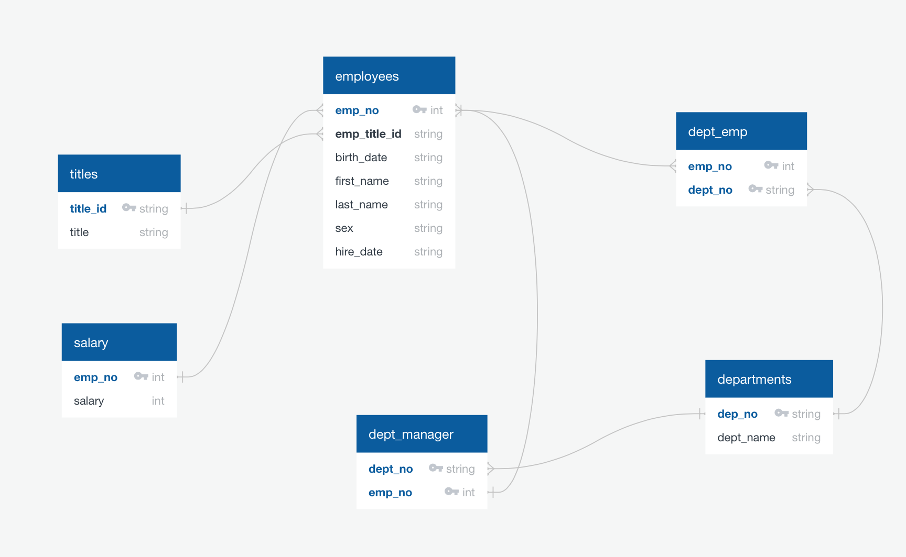

# Postgres Data Engineering & Data Analysis Project

SQL Homework Assignment 

For this assignement I engineered a postgres database to hold sample employee data from CSV's using an [ERD](https://www.quickdatabasediagrams.com).

I then imported the CSVs into a Postgres and ran some queries to get the information below.

1. I first ran a query to list details of each employee: employee number, last name, first name, sex, and salary.

`<SELECT employees.emp_no, employees.last_name, employees.first_name, employees.sex, salary.salary
  FROM employees
  LEFT JOIN salary
  ON employees.emp_no = salary.emp_no;r>`

2. Next I ran a query to list first name, last name, and hire date for employees who were hired in 1986.

`<SELECT  employees.last_name, employees.first_name, employees.hire_date
  FROM employees
  WHERE (SELECT EXTRACT (YEAR FROM hire_date) = '1986');>`

3. Then a ran a query that listed the manager of each department with their department number, department name, employee number, last name, first name.

`<SELECT departments.dept_no, departments.dept_name, dept_manager.emp_no, employees.last_name, employees.first_name
  FROM departments
  LEFT JOIN dept_manager
  ON departments.dept_no = dept_manager.dept_no
  LEFT JOIN employees
  ON dept_manager.emp_no = employees.emp_no;>`

4. The next query I created got me the department of each employee, plus their employee number, last name, first name, and department name.

`<SELECT employees.emp_no, employees.last_name, employees.first_name, departments.dept_name
  FROM employees
  LEFT JOIN dept_emp
  ON employees.emp_no = dept_emp.emp_no
  LEFT JOIN departments
  ON dept_emp.dept_no = departments.dept_no;>`

5. I then queried my database for first name, last name, and sex for employees whose first name is "Hercules" and last names begin with "B."

`<SELECT first_name, last_name, sex
  FROM employees
  WHERE first_name = 'Hercules' and last_name LIKE 'B%';>`

6. For this querry the goal was to create a list of all employees in the Sales department, including their employee number, last name, first name, and department name.

`<SELECT employees.emp_no, employees.last_name, employees.first_name, departments.dept_name
  FROM employees
  LEFT JOIN dept_emp
  ON employees.emp_no = dept_emp.emp_no
  LEFT JOIN departments
  ON dept_emp.dept_no = departments.dept_no
  WHERE dept_name = 'Sales';>`

7. I then listed all employees in the Sales and Development departments, including their employee number, last name, first name, and department name.

`<SELECT employees.emp_no, employees.last_name, employees.first_name, departments.dept_name
  FROM employees
  LEFT JOIN dept_emp
  ON employees.emp_no = dept_emp.emp_no
  LEFT JOIN departments
  ON dept_emp.dept_no = departments.dept_no
  WHERE dept_name = 'Sales' or dept_name = 'Development';>`

8. I also wrote a querry to list the frequency count of employee last names in descending order

`<SELECT employees.last_name, COUNT(employees.last_name) AS "Last_Name_Count"
  FROM employees
  GROUP BY employees.last_name
  ORDER BY "Last_Name_Count" DESC;>`

9. I then imported that data into a juptyer notebook with SQLalchemy and examined that data further with pandas

`<from sqlalchemy import create_engine
engine = create_engine('postgresql://localhost:5432/<your_db_name>')
connection = engine.connect()>`

10. I then created a histogram to visualize the most common salary ranges for employees.

11. Lastly I created a bar chart of average salary by title.

